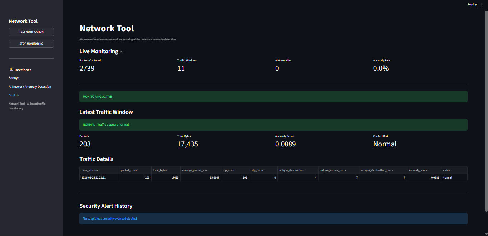

# 🌐 AI Network Anomaly Detection

<p align="center">
  <b>AI-powered real-time network monitoring and anomaly detection for Windows.</b>
</p>

<p align="center">
  <a href="https://github.com/soo6ya/AI-Network-Anomaly-Detection/releases">⬇️ Download Windows App</a>
  •
  <a href="https://github.com/soo6ya/AI-Network-Anomaly-Detection/issues">🐛 Report an Issue</a>
</p>

---

## 📌 Overview

**AI Network Anomaly Detection** is a Python-based network monitoring tool that captures live network traffic, extracts traffic-level features, applies a machine-learning anomaly detector, and displays the results through a live Streamlit dashboard.

The project combines **Scapy**, **Scikit-learn**, **Isolation Forest**, **Streamlit**, and **Windows notifications** to provide a practical cybersecurity monitoring workflow.

> ⚠️ This project is intended for educational purposes, cybersecurity learning, and authorized network monitoring.

---

## ✨ Key Features

| Feature | Description |
|---|---|
| 📡 **Live Monitoring** | Continuously captures and analyzes network traffic |
| 🤖 **AI Detection** | Uses an Isolation Forest model to identify unusual traffic |
| 📊 **Live Dashboard** | Displays packets, traffic windows, anomalies, and anomaly rate |
| 🚨 **Contextual Alerts** | Combines anomaly results with traffic context |
| 🔔 **Windows Notifications** | Sends desktop alerts for suspicious activity |
| 🧪 **Scenario Testing** | Includes controlled testing scripts |
| 🖥️ **Windows EXE** | Packaged standalone application available in Releases |
| 🧾 **Alert History** | Keeps a dashboard history of suspicious events |

---

## 🖥️ Dashboard

The application provides a live dashboard for monitoring network activity.

> 📸 **Add your dashboard screenshot here**

Place your screenshot at:

```text
screenshots/dashboard.png
```

Then this section will display it:

```markdown

```

### Dashboard Metrics

- **Packets Captured** — packets processed by the monitoring engine
- **Traffic Windows** — analyzed traffic windows
- **AI Anomalies** — windows classified as anomalous
- **Anomaly Rate** — percentage of anomalous windows
- **Monitoring Status** — current monitoring state
- **Security Alert History** — previously detected suspicious events

---

## 🧠 How It Works

```text
┌─────────────────────┐
│   Network Traffic   │
└──────────┬──────────┘
           │
           ▼
┌─────────────────────┐
│   Packet Capture    │
│       Scapy         │
└──────────┬──────────┘
           │
           ▼
┌─────────────────────┐
│ Feature Engineering │
└──────────┬──────────┘
           │
           ▼
┌─────────────────────┐
│   Isolation Forest  │
│     ML Model        │
└──────────┬──────────┘
           │
           ▼
┌─────────────────────┐
│ Contextual Analysis │
└──────────┬──────────┘
           │
       ┌───┴────┐
       ▼        ▼
┌───────────┐ ┌───────────────┐
│ Dashboard │ │   Windows     │
│  Results  │ │ Notification  │
└───────────┘ └───────────────┘
```

The system analyzes traffic in **time-based windows** instead of treating every packet as an independent security event.

---

## 📊 Detection Features

The monitoring pipeline uses traffic-level characteristics such as:

- Packet count
- Total bytes
- Average packet size
- TCP packet count
- UDP packet count
- Unique destinations
- Unique source ports
- Unique destination ports
- Anomaly score

These features are passed to the trained anomaly-detection model and then evaluated with additional traffic context.

---

## 🤖 Machine Learning

The project uses **Isolation Forest**, an unsupervised machine-learning algorithm provided by Scikit-learn.

The trained model is stored in:

```text
network_anomaly_model.pkl
```

The live pipeline is approximately:

```text
Traffic
   ↓
Feature Extraction
   ↓
Feature Vector
   ↓
Isolation Forest
   ↓
Anomaly Score
   ↓
Contextual Analysis
   ↓
Dashboard / Notification
```

---

## 🛠️ Technology Stack

### Core

- 🐍 Python
- 🎨 Streamlit

### Networking

- 📡 Scapy

### Machine Learning

- 🤖 Scikit-learn
- 🌲 Isolation Forest
- 📦 Joblib

### Data & Visualization

- Pandas
- NumPy
- Matplotlib

### Notifications

- Winotify

### Packaging

- PyInstaller

---

## 🚀 Run From Source

### Requirements

- Windows 10/11
- Python 3.x
- Npcap
- Administrator privileges may be required for live packet capture

### 1. Clone

```bash
git clone https://github.com/soo6ya/AI-Network-Anomaly-Detection.git
cd AI-Network-Anomaly-Detection
```

### 2. Create a virtual environment

```bash
python -m venv venv
venv\Scripts\activate
```

### 3. Install dependencies

```bash
pip install -r requirements.txt
```

### 4. Start the dashboard

```bash
python -m streamlit run dashboard.py
```

Open the local Streamlit address shown in the terminal.

### 5. Start monitoring

1. Open the dashboard.
2. Click **START MONITORING**.
3. Allow the application to capture network traffic.
4. Observe the live metrics.
5. Run controlled test scenarios when required.

---

## 🪟 Windows EXE

A packaged Windows version is available from the project's GitHub Releases.

### Download

👉 **[Download the latest Windows release](https://github.com/soo6ya/AI-Network-Anomaly-Detection/releases/latest)**

### Run

1. Download the ZIP.
2. Extract it.
3. Open the extracted `NetworkTool` folder.
4. Run:

```text
NetworkTool.exe
```

5. The application starts the local dashboard.
6. Open the displayed local address in your browser.
7. Click **START MONITORING**.

> The packaged application contains the required Python runtime and project dependencies.

---

## 🧪 Scenario Testing

The repository includes scenario-based testing scripts.

For example:

```bash
python scenario3_test.py
```

A typical test setup is:

```text
CMD 1
│
└── NetworkTool.exe
       │
       └── Dashboard + Live Monitoring


CMD 2
│
└── python scenario3_test.py
       │
       └── Controlled test traffic
```

The dashboard can then be observed for:

- Increased packet activity
- New traffic windows
- AI anomaly classifications
- Changes in anomaly rate
- Security alerts
- Windows notifications

> Only perform network testing on systems and networks you own or are explicitly authorized to monitor.

---

## 🔔 Security Notifications

When traffic satisfies the configured anomaly and contextual-risk conditions, the application can generate a Windows desktop notification.

The dashboard also maintains a **Security Alert History** for detected suspicious events.

An anomaly should be treated as a **security signal for investigation**, not automatic proof of a cyberattack.

---

## 📂 Project Structure

```text
AI-Network-Anomaly-Detection/
│
├── dashboard.py
├── launcher.py
├── live_engine.py
│
├── live_capture.py
├── live_monitor.py
├── live_predict.py
├── live_ai_monitor.py
│
├── packet_capture.py
├── feature_engineering.py
├── dataset_manager.py
├── normal_activity_capture.py
│
├── train_model.py
├── predict.py
├── analyze_anomalies.py
├── visualize_results.py
│
├── scenario3_test.py
├── test_analysis.py
│
├── network_anomaly_model.pkl
├── requirements.txt
│
├── .streamlit/
│   └── config.toml
│
└── README.md
```

Generated captures, analysis CSV files, images, virtual environments, and PyInstaller build directories are excluded through `.gitignore`.

---

## 📁 Important Files

| File | Purpose |
|---|---|
| `dashboard.py` | Main Streamlit interface |
| `live_engine.py` | Real-time monitoring engine |
| `live_capture.py` | Live packet capture |
| `feature_engineering.py` | Network feature extraction |
| `network_anomaly_model.pkl` | Trained ML model |
| `train_model.py` | Model training |
| `predict.py` | Prediction workflow |
| `scenario3_test.py` | Scenario-based testing |
| `launcher.py` | Windows EXE launcher |
| `requirements.txt` | Python dependencies |

---

## 🛡️ Responsible Use

This project is designed for:

- 🎓 Educational projects
- 🔐 Cybersecurity learning
- 🌐 Network monitoring experiments
- 🤖 Machine-learning experimentation
- 🧪 Authorized security testing

**Only monitor networks and devices that you own or have explicit permission to analyze.**

The tool is an anomaly-detection system and does not guarantee that every detected anomaly represents malicious activity.

---

## 📦 Release

**Current Version:** `v1.0.0`

**Status:** 🟢 Working Release

The current release includes:

- Real-time network monitoring
- AI-based anomaly detection
- Live Streamlit dashboard
- Windows security notifications
- Scenario testing
- Standalone Windows application

---

## 👨‍💻 Developer

### Soo6ya — Surya Dev

**Focus:** Networking • Cybersecurity • Python • AI

GitHub:

👉 **[github.com/soo6ya](https://github.com/soo6ya)**

Project:

👉 **[AI-Network-Anomaly-Detection](https://github.com/soo6ya/AI-Network-Anomaly-Detection)**

---

## ⭐ Support the Project

If you find this project useful:

- ⭐ Star the repository
- 🐛 Report bugs or issues
- 💡 Suggest improvements
- 🔀 Fork the project and experiment with it

---

## 📜 License

No specific open-source license is currently included with this repository.

Please check the repository's current usage terms before redistributing or modifying the project.
